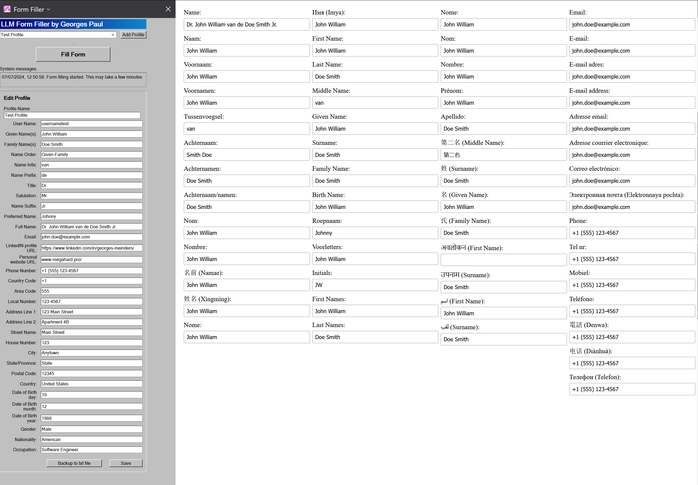

# LLM Form filling Firefox extension
A Firefox extension that fills forms using a large language model for better filling and less typing. 

This attempts to fix issues with all other form filling software that never seems to be able to get it right. Note: at the time of writing (July 2024) models that can run on a laptop (for example llama3 by Meta) are not good enough to make this solution perfect. Regardless of a few mistakes when filling forms, I still find this to perform much better than other form filling apps. 

# Screenie

# To try it out
This extension was written for Firefox

**Steps to get it to work:**
1. Clone or download this repo into some directory on your PC
2. Download and install Ollama from https://ollama.com/
3. In the command line type **ollama run llama3**
4. Wait for the model to completely download and run.
5. In Firefox in the address bar type "about:debugging#/runtime/this-firefox"
6. In Firefox Click "Load Temporary Add-on..." and load "manifest.json" in the directory where you stored the files in this repository.
7. In Firefox click "fill form" on a website with forms.
