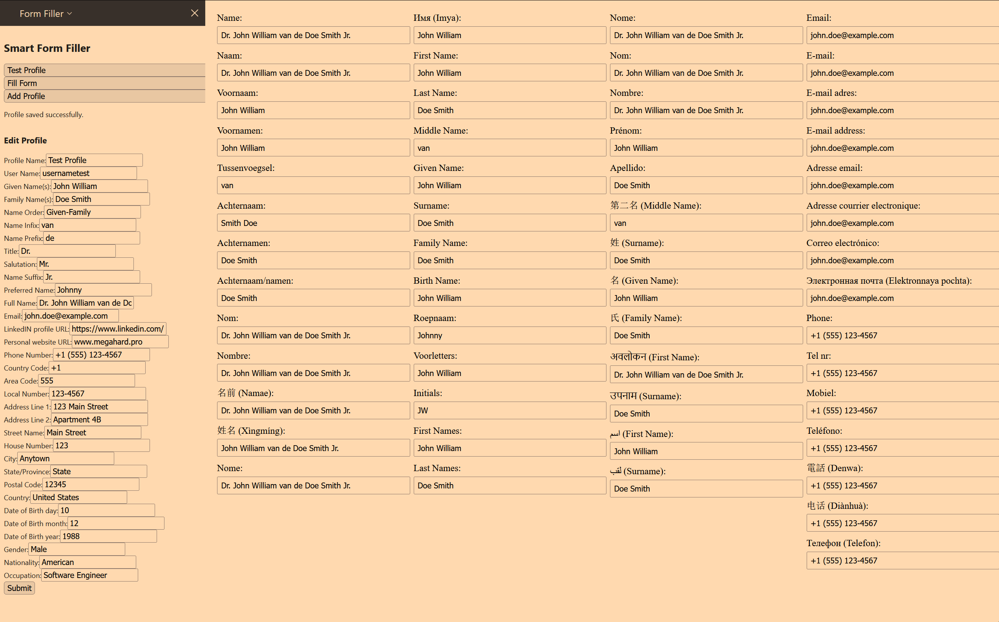

# Formfill
A Firefox extension that fills forms using ML for better filling and less typing. 

# To try it out
This extension was written for Firefox

**Steps to get it to work: **
1. Clone or download this repo into some directory on your PC
2. Download and install Ollama from https://ollama.com/
3. In the command line type <!-- ollama run gemma2 -->
4. Wait for the model to completely download and run.
5. In Firefox in the address bar type "about:debugging#/runtime/this-firefox"
6. In Firefox Click "Load Temporary Add-on..." and load "manifest.json" in the directory where you stored the files in this repository.
7. In Firefox on the extension toolbar click on the icon for this extension (a white puzzle piece) and click "fill form" on a website with forms.

# Screenie

